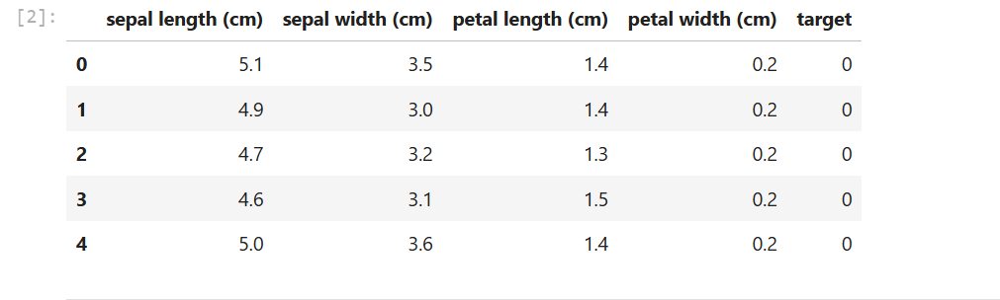
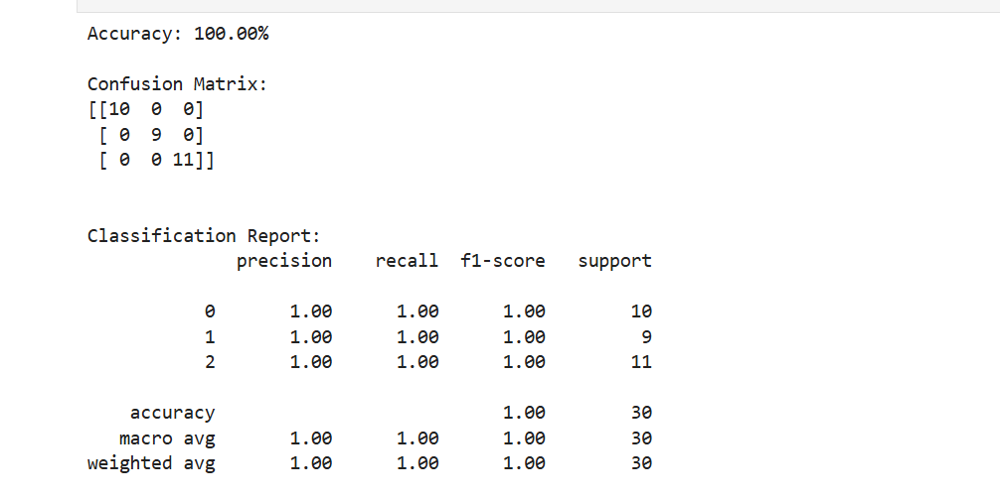
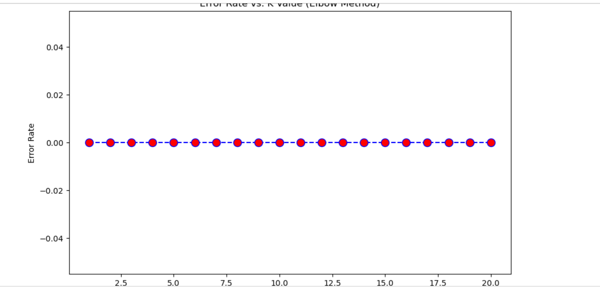

<div align="center">

# 🌸 Iris Flower Classification using K-Nearest Neighbors (KNN)

**A complete, beginner-friendly machine learning pipeline — data loading, feature scaling, KNN training, evaluation, and K-value tuning — built with Python and scikit-learn.**


</div>

---

## 📌 Overview

This project classifies iris flowers into three species — **Setosa**, **Versicolor**, and **Virginica** — from four physical measurements, using the **K-Nearest Neighbors (KNN)** algorithm.

It walks through the full supervised-learning workflow on the classic Iris dataset:

1. Load and inspect the data
2. Split into training and testing sets
3. Scale the features
4. Train a KNN classifier
5. Evaluate with accuracy, confusion matrix, precision, recall, and F1-score
6. Choose a suitable `K` using the elbow method

## 📊 Dataset

The [Iris dataset](https://scikit-learn.org/stable/modules/generated/sklearn.datasets.load_iris.html) ships with scikit-learn (no download needed).

| Property | Value |
|---|---|
| Samples | 150 |
| Features | 4 — sepal length, sepal width, petal length, petal width (all in cm) |
| Classes | 3 — Setosa (0), Versicolor (1), Virginica (2) |
| Class balance | 50 samples per class |

<p align="center">
  
</p>

## ⚙️ Methodology

| Step | Details |
|---|---|
| **Train/Test split** | 80% / 20% (120 train, 30 test), `random_state=42` |
| **Feature scaling** | `StandardScaler` — fitted on training data only, then applied to test data (prevents data leakage) |
| **Model** | `KNeighborsClassifier(n_neighbors=5)` |
| **Evaluation** | Accuracy, confusion matrix, classification report |
| **Tuning** | Test error rate for K = 1 to 20 (elbow method) |

> **Why scale features for KNN?** KNN is distance-based, so features with larger numeric ranges would otherwise dominate the distance calculation.

## 🏆 Results

On the 30-sample held-out test set the model achieved **100% accuracy**, with perfect precision, recall, and F1-score for all three classes.

<p align="center">
  
</p>

| Class | Precision | Recall | F1-score | Support |
|---|---|---|---|---|
| Setosa (0) | 1.00 | 1.00 | 1.00 | 10 |
| Versicolor (1) | 1.00 | 1.00 | 1.00 | 9 |
| Virginica (2) | 1.00 | 1.00 | 1.00 | 11 |
| **Overall accuracy** | | | **1.00** | **30** |

### Choosing K (Elbow Method)

The error rate on the test set was computed for every K from 1 to 20. It stays at 0 for all values, so there is no visible "elbow" on this particular split.

<p align="center">
  
</p>

### ⚠️ A note on interpreting these results

A perfect score is expected on this dataset with this split, but it should not be over-read:

- The Iris dataset is small and well-separated, especially Setosa.
- 30 test samples from a single split is a small evaluation set.
- As a sanity check, `src/iris_knn.py` also runs **5-fold cross-validation**, which gives a more realistic estimate of **~96% accuracy (± 2.5%)** for the same KNN setup.

## 📁 Project Structure

```
iris-knn-classification/
├── notebooks/
│   ├── Iris_Classification_KNN.ipynb   # Main notebook (code + outputs)
│   └── Iris_Classification_KNN.html    # Static HTML export of the notebook
├── src/
│   └── iris_knn.py                     # Standalone script (adds 5-fold CV)
├── images/
│   ├── 01_dataset_preview.png
│   ├── 02_model_evaluation.png
│   └── 03_elbow_method_plot.png
├── requirements.txt
├── .gitignore
├── LICENSE
└── README.md
```

## 🚀 Getting Started

### 1. Clone the repository

```bash
git clone https://github.com/<your-username>/iris-knn-classification.git
cd iris-knn-classification
```

### 2. (Optional) Create a virtual environment

```bash
python -m venv venv
source venv/bin/activate        # On Windows: venv\Scripts\activate
```

### 3. Install dependencies

```bash
pip install -r requirements.txt
```

### 4. Run the project

**Notebook:**

```bash
jupyter notebook notebooks/Iris_Classification_KNN.ipynb
```

**Or the standalone script:**

```bash
python src/iris_knn.py
```

## 🧰 Tech Stack

- **Python** — programming language
- **Pandas / NumPy** — data handling
- **scikit-learn** — dataset, scaling, KNN, metrics
- **Matplotlib** — visualization
- **Jupyter Notebook** — interactive development

## 🔭 Possible Improvements

- Use `GridSearchCV` / cross-validation to select K instead of a single test split
- Compare KNN against other classifiers (SVM, Decision Tree, Logistic Regression)
- Visualize decision boundaries using two features (e.g., petal length vs. petal width)
- Use stratified splitting to guarantee equal class proportions in train and test sets

## 👩‍💻 Author

**Faiza Shaukat**
BS Artificial Intelligence — University of Haripur, Khyber Pakhtunkhwa, Pakistan

- GitHub: [@your-username](https://github.com/your-username)
- LinkedIn: [your-linkedin-profile](https://www.linkedin.com/in/your-linkedin-profile)

## 📄 License

This project is licensed under the [MIT License](LICENSE).

---

<div align="center">

⭐ If you found this project helpful, consider giving it a star!

</div>
